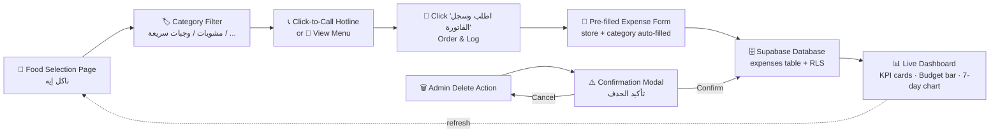

# 🍔 مصاريف العيلة | Family Expense Tracker & Food Decision Helper


> A mobile-first, right-to-left Arabic web app that helps an Egyptian family of four track daily food & supermarket expenses, stop budget leaks, and decide what to eat — all in one place. Built with TanStack Start, Supabase, and Tailwind CSS v4.

---

## 📌 Table of Contents

- [Overview](#-overview)
- [Architecture Diagram](#-architecture-diagram)
- [Key Features](#-key-features)
- [Role Access Matrix](#-role-access-matrix)
- [Tech Stack](#-tech-stack)
- [Supabase Schema](#-supabase-schema)
- [Quick Start](#-quick-start)
- [Project Structure](#-project-structure)
- [License](#-license)

---

## 🧭 Overview

**مصاريف العيلة** ("The Family's Expenses") is a Phase 1 + Phase 2 release aimed at a single family unit. The **Admin** (parent) logs expenses and manages restaurants; **Viewers** (family members) get a read-only dashboard so everyone stays in the loop without accidentally changing the numbers.

| Persona | What they can do |
| --- | --- |
| 👤 **Admin** | Log/edit/delete expenses, manage budget caps, add/edit/delete restaurants, upload menus, toggle dark mode |
| 👁️ **Viewer** | View the dashboard & restaurant directory, call hotlines, browse menus, toggle dark mode |

The whole UI is written in friendly **Egyptian Arabic**, laid out **right-to-left**, and tuned for AMOLED-friendly **pitch-black dark mode**.

---

## 🧩 Architecture Diagram



<details>
<summary>📦 Lifecycle in plain text</summary>

```
[Food Selection Page] → [Category Filter] → [Click "Order & Log"]
   → [Pre-filled Expense Form] → [Supabase Database] → [Live Dashboard Update]
```
</details>

---

## ✨ Key Features

### 💸 Expense Tracking & Dashboard
- **KPI cards** — current-week and current-month spend, computed with Saturday-start weeks.
- **Budget Cap progress bar** — weekly & monthly caps stored in Supabase and editable by the admin (no more hardcoded 4000 EGP).
- **7-day spending bar chart** — RTL-aware chart powered by Recharts.
- **Skeleton loaders** while data fetches, and a clean empty state: *«لسه مصممين نوفر.. مفيش مصاريف اتسجلت»*.
- **AMOLED dark mode** — true black (`oklch(0 0 0)`) background with full token theming.

### 🍜 Food Decision Engine (ناكل إيه)
- **Category filters** — المشويات · وجبات سريعة · شعبي وفطار · فطاير ومخبوزات · سوبر ماركت وثلاجة.
- **Click-to-Call hotline** — one tap dials the restaurant (`tel:` link).
- **Full-screen Menu Image Viewer** — uploaded menus are stored privately in the `receipts` bucket and shown via signed URLs; admins can upload straight from the viewer if none exists.
- **"آخر طلب" tags** — each restaurant card shows the last date an order was logged against it.
- **"اطلب وسجل الفاتورة"** — jumps to the expense form with store name + category pre-filled.
- **Admin CRUD** — `+ إضافة مطعم/سوبرماركت` button, plus pencil/trash icons on every card (admin-only).

### 🕒 Dynamic Recent Orders (أحدث الطلبات)
- Replaces the old static presets with the **latest 3 logged orders**, pulled live from `expenses`.
- A **"عرض المزيد (+N)"** link opens **سجل الأوردرات السابقة** — a paginated full-history page (15 per page, "حمّل كمان" infinite-scroll button).
- Subtle empty message when nothing's logged yet: *«لم يتم تسجيل أوردرات بعد»*.

### 🔐 Admin vs. Viewer Role Access
- Role resolved per login via the Supabase `has_role()` RPC (security-definer), with a `user_roles` fallback.
- First-ever signup is auto-promoted to **admin** (DB trigger); everyone after is a **viewer**.

### 🛡️ Global Safety
- **Custom confirmation modal** for every deletion (dashboard, restaurants, orders) — no native `confirm()` popups.
- Red destructive "تأكيد الحذف" button, neutral "إلغاء", blurred backdrop overlay, fully accessible & RTL.

### 🎨 UX Polish
- Password **show/hide eye toggle** on login & signup, RTL-aligned so it never overlaps Arabic text.
- Graceful **rate-limit (429) handling** → friendly toast: *«برجاء الانتظار قليلاً قبل إعادة المحاولة»*; loading state always clears on error.
- Persisted **dark-mode toggle** in the bottom nav, visible to everyone.

---

## 🧮 Role Access Matrix

| Capability | 👤 Admin | 👁️ Viewer |
| --- | :---: | :---: |
| View dashboard & KPIs | ✅ | ✅ |
| Browse restaurants & menus | ✅ | ✅ |
| Click-to-call hotline | ✅ | ✅ |
| Toggle dark mode | ✅ | ✅ |
| Log / edit / delete expenses | ✅ | ❌ |
| Add / edit / delete restaurants | ✅ | ❌ |
| Upload menu images | ✅ | ❌ |
| Edit weekly/monthly budget caps | ✅ | ❌ |
| See admin settings (shield icon) | ✅ | ❌ |
| Reorder past order → expense form | ✅ | ❌ |

---

## 🛠️ Tech Stack

| Layer | Technology |
| --- | --- |
| **Framework** | TanStack Start v1 (SSR/SSG) on Vite 8 |
| **UI** | React 19, Tailwind CSS v4 (oklch tokens), shadcn/ui (Radix primitives) |
| **Charts** | Recharts |
| **Icons** | lucide-react |
| **Date picker** | react-day-picker + date-fns |
| **Data / cache** | TanStack Query (polling on load — no realtime subscriptions) |
| **Backend / Auth / Storage** | Supabase (Postgres + RLS + Auth + Storage buckets) |
| **Language** | TypeScript 5 |
| **Fonts** | Cairo (Arabic), loaded via `<link>` in the root route head |

---

## 🗄️ Supabase Schema

> All tables live in the `public` schema with Row-Level Security enabled. Grants follow the `authenticated` + `service_role` pattern; anon is never granted where policies scope to `auth.uid()`.

### `expenses`
| Column | Type | Notes |
| --- | --- | --- |
| `id` | uuid | PK, default `gen_random_uuid()` |
| `amount` | numeric | expense amount (EGP) |
| `store_name` | text | restaurant / store |
| `category` | text | غداء · سوبر ماركت · أخرى |
| `spent_on` | date | the day it was spent |
| `note` | text | optional |
| `image_url` | text | optional receipt path in `receipts` bucket |
| `created_by` | uuid | auth user id |
| `created_at` / `updated_at` | timestamptz | audit timestamps |

**RLS:** authenticated users `SELECT`; only admins `INSERT`/`UPDATE`/`DELETE`.

### `restaurants`
| Column | Type | Notes |
| --- | --- | --- |
| `id` | uuid | PK |
| `name` | text | place name |
| `category` | text | مشويات · وجبات سريعة · شعبي وفطار · فطاير ومخبوزات · سوبر ماركت وثلاجة |
| `hotline` | text | nullable, click-to-call |
| `location` | text | nullable, branch/address |
| `menu_url` | text | nullable — https link or storage path |
| `is_preset` | boolean | legacy preset flag |
| `preset_title` / `preset_description` | text | legacy preset copy (unused on the page now) |
| `created_at` / `updated_at` | timestamptz | audit timestamps |

**RLS:** authenticated users `SELECT`; only admins `INSERT`/`UPDATE`/`DELETE`.

### Supporting tables
- **`user_roles`** — `(user_id, role)` where `role` is the `app_role` enum (`admin` | `viewer`).
- **`profiles`** — mirror of `auth.users` (display name, email) via a trigger.
- **`budget_settings`** — single row holding `weekly_cap`, `monthly_cap`, `currency`.
- **`has_role(_user_id, _role)`** — security-definer function used by RLS policies to avoid recursion.
- **`handle_new_user`** trigger — first signup becomes admin; all others become viewer.

---

## 🚀 Quick Start

### Prerequisites
- **Node.js 20+** (install via [nvm](https://github.com/nvm-sh/nvm#installing-and-updating) recommended)
- A **Supabase** project (Auth + Postgres + Storage)

### 1. Clone & install
```bash
git clone <this-repository-url>
cd <repository-name>
npm install
```

### 2. Configure environment
Create a `.env` file in the project root:

```env
# Supabase
SUPABASE_URL=https://your-project.supabase.co
SUPABASE_ANON_KEY=your-anon-key
SUPABASE_SERVICE_ROLE_KEY=your-service-role-key
```

> The app reads publishable keys on the client (`import.meta.env.VITE_*`) and the service role key server-side only, inside handlers. Match the variable names your Supabase integration expects.

### 3. Apply the database migration
Run the project's SQL migration in the Supabase SQL editor (creates `app_role` enum, `user_roles`, `profiles`, `expenses`, `budget_settings`, `restaurants`, the `has_role` function, the `handle_new_user` trigger, RLS policies, and the private `receipts` storage bucket with a 10 MB limit).

### 4. Run the dev server
```bash
npm run dev
```

The app boots on `http://localhost:8080`. The **first account** you sign up with becomes the admin (after email confirmation); subsequent signups are viewers.

### Build for production
```bash
npm run build      # production build
npm run preview    # preview the production build
```

---

## 📁 Project Structure

```
src/
├── routes/
│   ├── __root.tsx              # RTL shell, theme script, AuthProvider, toaster
│   ├── index.tsx               # redirect → /dashboard or /auth
│   ├── auth.tsx                # login/signup with eye toggle + rate-limit handling
│   └── _authenticated/
│       ├── route.tsx           # auth gate
│       ├── dashboard.tsx       # KPIs, budget bar, 7-day chart, recent list
│       ├── log.tsx             # expense form (create/edit, image upload, pre-fill)
│       ├── food.tsx            # ناكل إيه — restaurants + recent orders + menu viewer
│       └── orders.tsx          # سجل الأوردرات السابقة (paginated history)
├── components/
│   ├── AppShell.tsx            # header + bottom nav (admin shield, dark toggle)
│   ├── AdminSettingsDialog.tsx # weekly/monthly budget cap editor
│   ├── RestaurantDialog.tsx    # add/edit restaurant + menu upload helpers
│   ├── OrderCard.tsx           # recent-order card with reorder action
│   └── ConfirmDelete.tsx       # global confirmation modal provider
├── hooks/
│   ├── useAuth.tsx             # session + role via has_role RPC
│   └── useTheme.ts             # persisted dark-mode toggle
├── lib/
│   └── expenses.ts             # queries, formatters, date helpers
└── integrations/supabase/      # generated client + types
```

---

## 📄 License

This project was built with [Lovable](https://lovable.dev).
